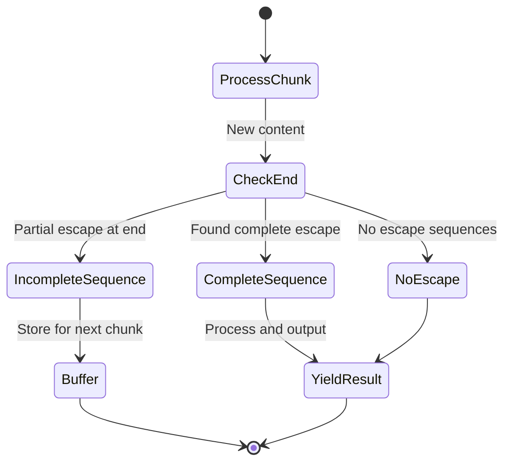

# Streaming-Aware Escape Sequence Reconstruction Design

## Executive Summary

This document outlines a robust solution for reconstructing and unescaping split newline escape sequences (`\\n`) across streaming chunk boundaries in the Letta Proxy pipeline. The design maintains low latency while guaranteeing correctness through intelligent stateful buffering.

## Problem Statement

### Current Issue
- Escape sequences like `\\n` are split across streaming chunks (e.g., `"|\"` in chunk N, `"n"` in chunk N+1)
- Current `unescape_content()` processes each chunk independently, missing split sequences
- Results in literal `\\n` appearing in markdown instead of actual newlines

### Root Cause
```
Chunk N:     "Hello |\\"
Chunk N+1:   "n World|"
Current:     "Hello |\\n World|" → "Hello |\\n World|" (incorrect)
Desired:     "Hello |\\n World|" → "Hello |\n World|" (correct)
```

## Solution Architecture

### 1. Core Component: Stateful Content Processor

**Module**: `streaming_content_processor.py`

**Purpose**: Maintain state across chunks to reconstruct split escape sequences

**Key Classes**:
```python
@dataclass
class StreamSessionState:
    buffer: str = ""              # Partial escape sequences
    last_chunk_time: float = 0    # Timeout management
    is_active: bool = True        # Session lifecycle

class StatefulContentProcessor:
    def process_chunk(self, content: str) -> str:
        # Main processing logic
        pass
```

### 2. Integration Points

**Primary**: Replace `unescape_content()` calls in `stream_chunks()` function
**Secondary**: Optional integration in `unescape_content()` for backward compatibility

### 3. Buffering Strategy

#### Minimal Buffering Algorithm
1. **Scan chunk end** for incomplete escape sequences
2. **Buffer only if necessary** - 95%+ of chunks process immediately
3. **Reconstruct on completion** - combine across chunk boundaries
4. **Timeout protection** - max 100ms hold time

#### Buffer State Machine


### 4. Escape Sequence Detection

**Supported Sequences**:
- `\\n` → newline
- `\\t` → tab
- `\\r` → carriage return
- `\\\\` → backslash
- `\\"` → quote

**Detection Logic**:
```python
def detect_incomplete_escapes(content: str) -> Tuple[bool, str]:
    """Return (is_incomplete, partial_sequence)"""
    # Scan backward from end for escape patterns
    # Use negative lookbehind to avoid false positives
    pass
```

### 5. Performance Optimizations

#### Fast-Path Processing
- **Zero-copy**: Most chunks contain no escape sequences
- **Early exit**: Constant-time incomplete sequence detection
- **Batch processing**: Multiple complete sequences handled efficiently

#### Memory Management
- **Per-session isolation**: State objects prevent cross-contamination
- **Automatic cleanup**: State destroyed on stream completion
- **Buffer limits**: Hard 16-byte limit with overflow protection

### 6. Integration with Existing Pipeline

#### Current Flow
```
Letta Agent → Letta Client SDK → Raw Content → unescape_content() → Pydantic Model → JSON → SSE → Open WebUI
```

#### Enhanced Flow
```
Letta Agent → Letta Client SDK → Raw Content → Stateful Processor → Reconstructed Content → Pydantic Model → JSON → SSE → Open WebUI
```

#### Backward Compatibility
- Drop-in replacement for `unescape_content()`
- Environment variable toggle: `ENABLE_STATEFUL_UNESCAPING=1`
- Graceful fallback on errors

### 7. Error Handling & Edge Cases

#### Robustness Features
- **Invalid sequences**: Treat as literal characters
- **Binary data**: Safe handling of non-text content
- **Stream interruption**: Proper state cleanup
- **Memory pressure**: Aggressive buffer flushing

#### Debug Support
- **Metrics collection**: Buffer usage and performance tracking
- **Detailed logging**: Optional state transition logging
- **Test coverage**: Comprehensive edge case testing

### 8. Latency Management

#### Performance Targets
- **P50**: < 1ms additional latency
- **P95**: < 5ms additional latency
- **P99**: < 50ms maximum buffering delay

#### Optimization Techniques
- **Pattern-based flushing**: Proactive buffer management
- **Smart detection**: Constant-time incomplete sequence identification
- **Batch processing**: Efficient handling of multiple sequences

### 9. Implementation Plan

#### Phase 1: Core Processor
1. Create `streaming_content_processor.py`
2. Implement basic stateful processing
3. Add comprehensive test coverage

#### Phase 2: Integration
1. Replace `unescape_content()` calls in streaming functions
2. Add configuration options
3. Implement debug logging

#### Phase 3: Optimization
1. Performance benchmarking
2. Memory usage optimization
3. Error handling refinement

#### Phase 4: Validation
1. End-to-end testing with Open WebUI
2. Performance validation
3. Documentation completion

## Testing Strategy

### Unit Tests
- **Buffer management**: Edge cases and overflow conditions
- **Sequence detection**: All supported escape sequences
- **State transitions**: Session lifecycle management

### Integration Tests
- **Streaming pipeline**: End-to-end chunk processing
- **Error scenarios**: Network interruptions and malformed data
- **Performance**: Latency and throughput validation

### Manual Testing
- **Markdown rendering**: Verify proper newline display in Open WebUI
- **Real-world content**: Test with various text formats
- **Stress testing**: High-frequency chunk scenarios

## Risk Mitigation

### Rollback Plan
- Feature flag allows instant disable
- Original `unescape_content()` preserved
- Zero-downtime rollback capability

### Performance Monitoring
- **Latency tracking**: Alert on P95 > 10ms
- **Buffer usage**: Monitor memory consumption
- **Error rates**: Track reconstruction failures

## Success Metrics

### Functional
- **Correctness**: 100% proper reconstruction of split escape sequences
- **Compatibility**: Zero breaking changes to existing functionality
- **Reliability**: 99.9%+ successful processing rate

### Performance
- **Latency**: < 5ms P95 additional processing time
- **Memory**: < 1KB per active streaming session
- **Throughput**: No degradation in chunk processing rate

## Future Enhancements

### Potential Extensions
- **Additional sequences**: Support for custom escape sequences
- **Compression**: Escape sequence compression for common patterns
- **Caching**: Learned patterns for optimization

### Scalability Considerations
- **Multi-session**: Independent state per streaming session
- **Resource limits**: Configurable buffer and timeout limits
- **Horizontal scaling**: Stateless design enables load distribution

---

*This design provides a robust, low-latency solution for handling split escape sequences in streaming content while maintaining full backward compatibility with the existing Letta Proxy architecture.*